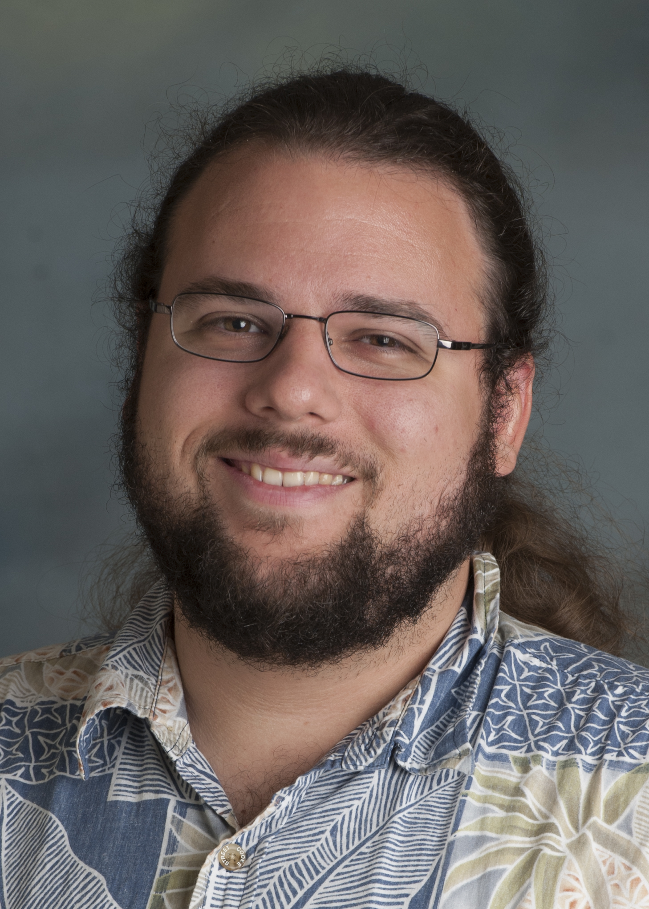

# 2022 CSCSU Organizing Committee

## Glen Bruns

 

&nbsp;&nbsp;&nbsp;&nbsp;&nbsp;&nbsp; Associate Professor, Computer Science

&nbsp;&nbsp;&nbsp;&nbsp;&nbsp;&nbsp; CSU Monterey Bay

&nbsp;&nbsp;&nbsp;&nbsp;&nbsp;&nbsp; [gbruns@csumb.edu](gbruns@csumb.edu)

 
 
 
 
 
 
 

## Kyle Dewey

&nbsp;&nbsp;&nbsp;&nbsp;&nbsp;&nbsp; Assistant Professor, Computer Science

&nbsp;&nbsp;&nbsp;&nbsp;&nbsp;&nbsp; CSU Northridge

&nbsp;&nbsp;&nbsp;&nbsp;&nbsp;&nbsp; [kyle.dewey@csun.edu](kyle.dewey@csun.edu) 

 
 
 
 
 
 
 
 

## Jason Isaacs

&nbsp;&nbsp;&nbsp;&nbsp;&nbsp;&nbsp; Associate Professor, Computer Science

&nbsp;&nbsp;&nbsp;&nbsp;&nbsp;&nbsp; CSU Channel Islands

&nbsp;&nbsp;&nbsp;&nbsp;&nbsp;&nbsp; [jason.isaacs@csuci.edu](jason.isaacs@csuci.edu)

 
 
 
 
 
 
 
 

## Katya Mkrtchyan

&nbsp;&nbsp;&nbsp;&nbsp;&nbsp;&nbsp; Assistant Professor, Computer Science

&nbsp;&nbsp;&nbsp;&nbsp;&nbsp;&nbsp; CSU Northridge

&nbsp;&nbsp;&nbsp;&nbsp;&nbsp;&nbsp; [katya.mkrtchyan@csun.edu](katya.mkrtchyan@csun.edu)